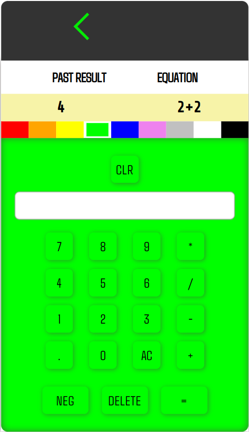

<body style="scroll-behavior:smooth;transition:.5s;"></body>
<html style="transition:.5s"></html>
<!--title -->

<h1 style="background:#000;padding:.25rem .5rem;border-radius:12px;color:ghostwhite;">Interactive Calculator</h1>

<!-- calculator gif-->

    <h3 style="text-decoration:underline">Table of Contents</h3>

<ol style="width:100%;">
<li><a style="color:ghostwhite;text-decoration:none" href="#about">About the Project</a></li>
<li><a style="color:ghostwhite;text-decoration:none" href="#getting-started">Getting Started</a></li>
<li><a style="color:ghostwhite;text-decoration:none" href="#usage">Usage</a></li>
<li><a style="color:ghostwhite;text-decoration:none" href="#license">License</a></li>
<li><a style="color:ghostwhite;text-decoration:none" href="#contact">Contact</a></li>
</ol>

<h2 style="background:#fff;padding:.25rem .5rem;border-radius:12px;color:#000;">About the Project</h2>
<!-- calculator img -->
    

        
       
Imagine working with a calculator where one can look back on recently-used equations & results.
This component does exactly that!

We have a calculator designed with custom <b><em>HTML</em></b> elements & <b><em>CSS</em></b> styles. The elements are manipulated with <b><em>JavaScript</em></b>, which include server requests with <b><em>AJAX.</em></b>

Unless the result is <b><em>undefined</em></b>, true evaluations will route to a <b><em>Postgresql</em></b> database.
Finally a clearing(CLR) function truncates(removes) all data from the database.

<h3><em>Languages & Tools:</em></h3>
<h4>Frontend</h4>
<ul style="margin-top:-1.25rem;">
<li>HTML</li>
<li>CSS</li>
<li>JavaScript</li>
</ul>

<h4>Backend</h4>
<ul style="margin-top:-1.25rem;">
<li>NodeJs</li>
<li>Postgres</li>
<li>AJAX</li> 

<h2 style="background:#fff;padding:.25rem .5rem;border-radius:12px;color:#000;">Usage</h2>
<h4>POST</h4>
<h4>GET</h4>

license Section

contact Section

